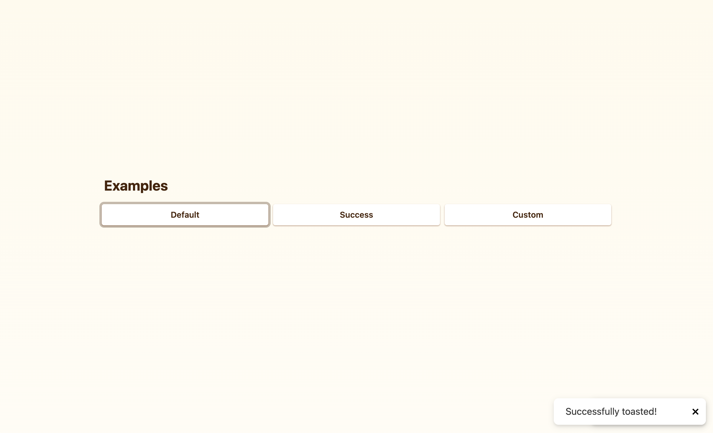

# Toast Component Project



대상: 주니어-미드 레벨 프론트엔드 엔지니어

이 프로젝트에서는 React의 Context를 사용하여 Toast 컴포넌트 구현합니다.

- 이 문서가 요구하는 내용에 맞춰 구현합니다.
- Component 라이브러리는 사용할 수 없습니다.
- 어떠한 CSS 라이브러리를 사용해도 무방합니다.
- Style은 자유롭게 구현해주세요.
- 가급적이면 Typescript를 사용해주세요.

## Getting Started

이 프로젝트는 vite로 생성되었습니다. Node.js와 NPM을 사용하여 로컬에서 실행할 수 있습니다.

```bash
# Install dependencies:
npm install

# Run a development server:
npm run dev
```

## Usage

Toast는 닫기 버튼을 클릭하거나 시간 초과 후 자동으로 닫힙니다.

Toast는 애플리케이션 창의 상단 또는 하단에 표시되도록 구성할 수 있으며, 한 번에 두 개 이상의 Toast를 화면에 표시할 수 있습니다.

### 1. Show Toast

```js
function ToastExample() {
  const toast = useToast();

  return (
    <button
      onClick={() =>
        toast({
          variant: "success",
          message: "Successfully toasted!",
          duration: 5000,
        })
      }
    >
      Show Toast
    </button>
  );
}
```

> Context를 이용하기 때문에 <Toaster>보다 하나 이상의 컴포넌트 레벨 아래에서 useToast를 호출해야 합니다.

### 2. Custom component

기본 Toast UI 대신 사용자 구성 UI를 나타냅니다.

```js
function CustomToastExample() {
  const toast = useToast();

  return (
    <button
      onClick={() =>
        toast({
          render: () => <div>Hello World</div>,
        })
      }
    >
      Show Toast
    </button>
  );
}
```

### 3. Change Position

모든 Toast가 나타나는 위치를 설정합니다.

```js
ReactDOM.createRoot(document.getElementById("root") as HTMLElement).render(
  <React.StrictMode>
    <Toaster position="bottom-center">
      <App />
    </Toaster>
  </React.StrictMode>
);
```

## Docs

### useToast

​  
**Return value**  
toast 함수를 반환합니다.

### toast

함수가 호출되면 Toast UI를 화면에 나타냅니다.

**Parameters**
`useToast` hook은 optional object를 받을 수 있습니다.

- variant (optional)
  - Type - `"default" | "success"`
  - Default - `"default"`
- message (optional)
  - Type - `string`
- duration (optional)
  - Type - `number`
  - Default - 3000
- render (optional)
  - Description - 리액트 컴포넌트를 반환하는 함수를 사용하여 사용자 구성 Toast UI를 설정합니다.
  - Type - `function`

### Toaster Props

**postion (optional)**

- Type - `"top-left" | "top-center" | "top-right" | "bottom-left" | "bottom-center" | "bottom-right"`
- Default - `"bottom-right"`
